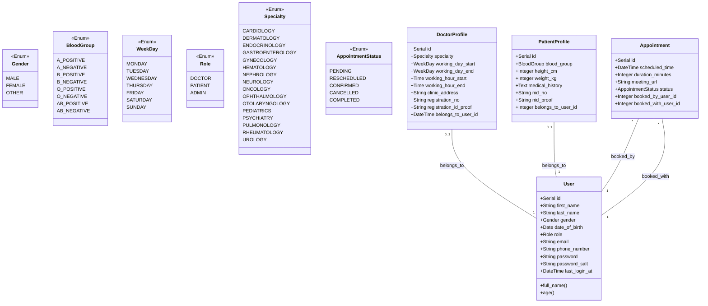

```mermaid
classDiagram
    class Gender {
        <<Enum>>
        MALE
        FEMALE
        OTHER
    }
    
    class BloodGroup {
        <<Enum>>
        A_POSITIVE
        A_NEGATIVE
        B_POSITIVE
        B_NEGATIVE
        O_POSITIVE
        O_NEGATIVE
        AB_POSITIVE
        AB_NEGATIVE
    }
    
    class WeekDay {
        <<Enum>>
        MONDAY
        TUESDAY
        WEDNESDAY
        THURSDAY
        FRIDAY
        SATURDAY
        SUNDAY
    }
    
    class Role {
        <<Enum>>
        DOCTOR
        PATIENT
        ADMIN
    }
    
    class Specialty {
        <<Enum>>
        CARDIOLOGY
        DERMATOLOGY
        ENDOCRINOLOGY
        GASTROENTEROLOGY
        GYNECOLOGY
        HEMATOLOGY
        NEPHROLOGY
        NEUROLOGY
        ONCOLOGY
        OPHTHALMOLOGY
        OTOLARYNGOLOGY
        PEDIATRICS
        PSYCHIATRY
        PULMONOLOGY
        RHEUMATOLOGY
        UROLOGY
    }
    
    class AppointmentStatus {
        <<Enum>>
        PENDING
        RESCHEDULED
        CONFIRMED
        CANCELLED
        COMPLETED
    }
    
    
    class User {
        +Serial id
        +String first_name
        +String last_name
        +Gender gender
        +Date date_of_birth
        +Role role
        +String email
        +String phone_number
        +String password
        +String password_salt
        +DateTime last_login_at
        +full_name()
        +age()
    }
    class DoctorProfile {
        +Serial id
        +Specialty specialty
        +WeekDay working_day_start
        +WeekDay working_day_end
        +Time working_hour_start
        +Time working_hour_end
        +String clinic_address
        +String registration_no
        +String registration_id_proof
        +DateTime belongs_to_user_id
    }
    class PatientProfile {
        +Serial id
        +BloodGroup blood_group
        +Integer height_cm
        +Integer weight_kg
        +Text medical_history
        +String nid_no
        +String nid_proof
        +Integer belongs_to_user_id
    }
    class Appointment {
        +Serial id
        +DateTime scheduled_time
        +Integer duration_minutes
        +String meeting_url
        +AppointmentStatus status
        +Integer booked_by_user_id
        +Integer booked_with_user_id
    }
    
    
    DoctorProfile "0..1" -- "1" User : belongs_to
    PatientProfile "0..1" -- "1" User : belongs_to
    Appointment "*" -- "1" User : booked_by
    Appointment "*" -- "1" User : booked_with
```
