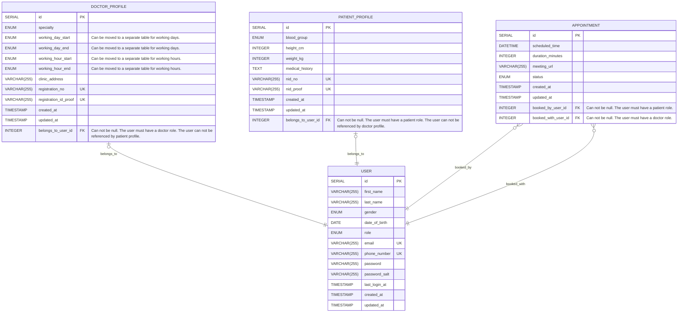

```mermaid
erDiagram
    USER {
        SERIAL id PK
        VARCHAR(255) first_name
        VARCHAR(255) last_name
        ENUM gender
        DATE date_of_birth
        ENUM role
        VARCHAR(255) email UK
        VARCHAR(255) phone_number UK
        VARCHAR(255) password
        VARCHAR(255) password_salt
        TIMESTAMP last_login_at
        TIMESTAMP created_at
        TIMESTAMP updated_at
    }
    
    DOCTOR_PROFILE {
        %% Working day and hour can possibly be a separate table
        %% For now, it is assumed that all doctors have consecutive working day with fixed working hours
        SERIAL id PK
        ENUM specialty
        ENUM working_day_start "Can be moved to a separate table for working days."
        ENUM working_day_end "Can be moved to a separate table for working days."
        ENUM working_hour_start "Can be moved to a separate table for working hours."
        ENUM working_hour_end "Can be moved to a separate table for working hours."
        VARCHAR(255) clinic_address
        VARCHAR(255) registration_no UK
        VARCHAR(255) registration_id_proof UK
        TIMESTAMP created_at
        TIMESTAMP updated_at
        INTEGER belongs_to_user_id FK "Can not be null. The user must have a doctor role. The user can not be 
        referenced by patient profile."
    }
    
    PATIENT_PROFILE {
        SERIAL id PK
        ENUM blood_group
        INTEGER height_cm
        INTEGER weight_kg
        TEXT medical_history
        VARCHAR(255) nid_no UK
        VARCHAR(255) nid_proof UK
        TIMESTAMP created_at
        TIMESTAMP updated_at
        INTEGER belongs_to_user_id FK "Can not be null. The user must have a patient role. The user can not be 
        referenced by doctor profile."
    }
    
    APPOINTMENT {
        SERIAL id PK
        DATETIME scheduled_time
        INTEGER duration_minutes
        VARCHAR(255) meeting_url
        ENUM status
        TIMESTAMP created_at
        TIMESTAMP updated_at
        INTEGER booked_by_user_id FK "Can not be null. The user must have a patient role."
        INTEGER booked_with_user_id FK "Can not be null. The user must have a doctor role."
    }
    
    DOCTOR_PROFILE |o--|| USER : "belongs_to"
    PATIENT_PROFILE |o--|| USER : "belongs_to"
    APPOINTMENT }o--|| USER : "booked_by"
    APPOINTMENT }o--|| USER : "booked_with"
```