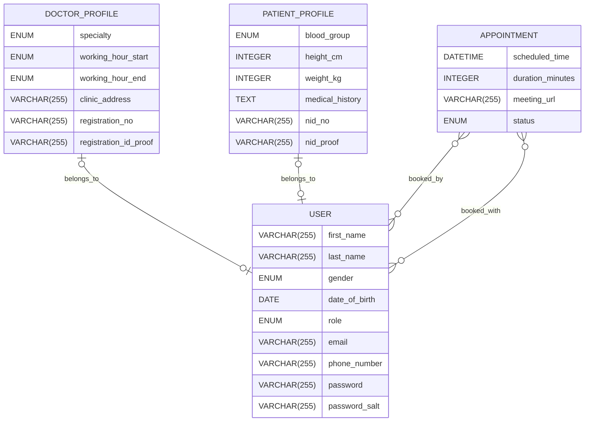

```mermaid
erDiagram
    USER {
        VARCHAR(255) first_name
        VARCHAR(255) last_name
        ENUM gender
        DATE date_of_birth
        ENUM role
        VARCHAR(255) email
        VARCHAR(255) phone_number
        VARCHAR(255) password
        VARCHAR(255) password_salt
    }
    
    DOCTOR_PROFILE {
        ENUM specialty
        ENUM working_hour_start
        ENUM working_hour_end
        VARCHAR(255) clinic_address
        VARCHAR(255) registration_no
        VARCHAR(255) registration_id_proof
    }
    
    PATIENT_PROFILE {
        ENUM blood_group
        INTEGER height_cm
        INTEGER weight_kg
        TEXT medical_history
        VARCHAR(255) nid_no
        VARCHAR(255) nid_proof
    }
    
    APPOINTMENT {
        DATETIME scheduled_time
        INTEGER duration_minutes
        VARCHAR(255) meeting_url
        ENUM status
    }
    
    DOCTOR_PROFILE |o--o| USER : "belongs_to"
    PATIENT_PROFILE |o--o| USER : "belongs_to"
    APPOINTMENT }o--o{ USER : "booked_by"
    APPOINTMENT }o--o{ USER : "booked_with"
```