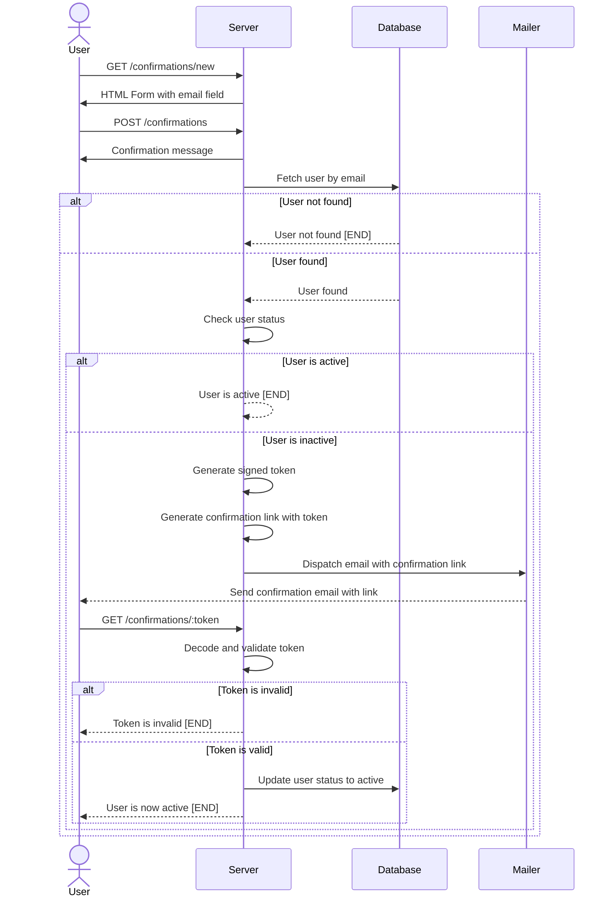

```mermaid
sequenceDiagram
    actor User
    User ->> Server: GET /confirmations/new
    Server ->> User: HTML Form with email field
    User ->> Server: POST /confirmations
    Server ->> User: Confirmation message
    Server ->> Database: Fetch user by email
    alt User not found
        Database -->> Server: User not found [END]
    else User found
        Database -->> Server: User found
        Server ->> Server: Check user status
        alt User is active
            Server -->> Server: User is active [END]
        else User is inactive
            Server ->> Server: Generate signed token
            Server ->> Server: Generate confirmation link with token
            Server ->> Mailer: Dispatch email with confirmation link
            Mailer -->> User: Send confirmation email with link
            User ->> Server: GET /confirmations/:token
            Server ->> Server: Decode and validate token
            alt Token is invalid
                Server -->> User: Token is invalid [END]
            else Token is valid
                Server ->> Database: Update user status to active
                Server -->> User: User is now active [END]
            end
        end
    end
```