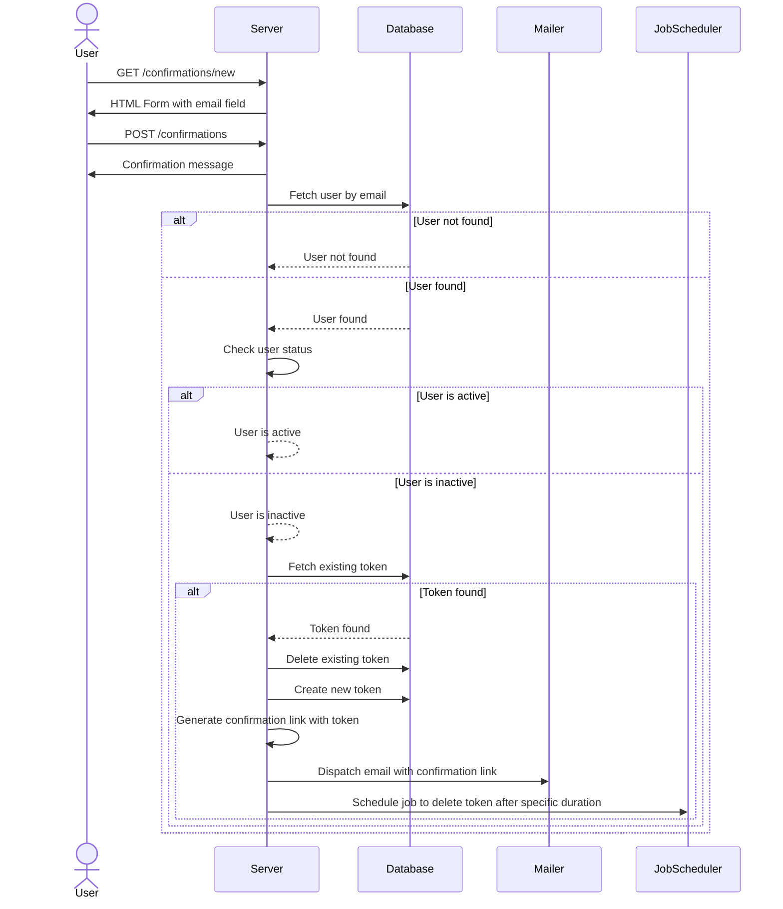

```mermaid
sequenceDiagram
    actor User
    User ->> Server: GET /confirmations/new
    Server ->> User: HTML Form with email field
    User ->> Server: POST /confirmations
    Server ->> User: Confirmation message
    Server ->> Database: Fetch user by email
    alt User not found
        Database -->> Server: User not found
    else User found
        Database -->> Server: User found
        Server ->> Server: Check user status
        alt User is active
            Server -->> Server: User is active
        else User is inactive
            Server -->> Server: User is inactive
            Server ->> Database: Fetch existing token
            alt Token found
                Database -->> Server: Token found
                Server ->> Database: Delete existing token
            Server ->> Database: Create new token
            Server ->> Server: Generate confirmation link with token
            Server ->> Mailer: Dispatch email with confirmation link
            Server ->> JobScheduler: Schedule job to delete token after specific duration
            end
        end
    end
```