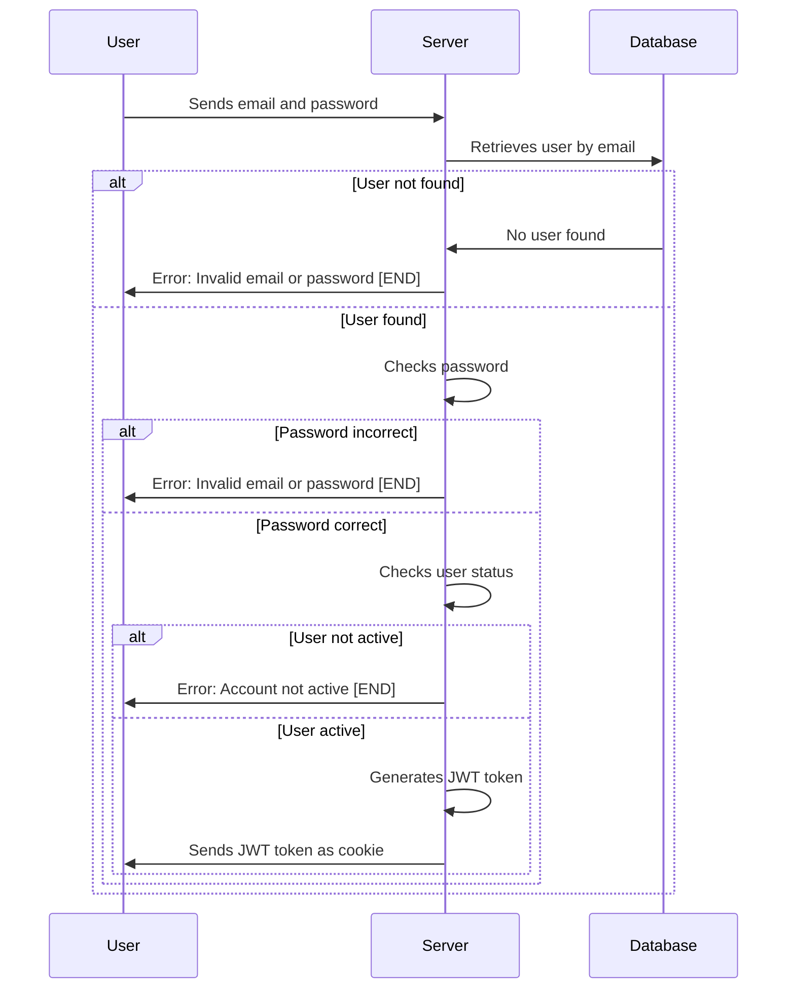
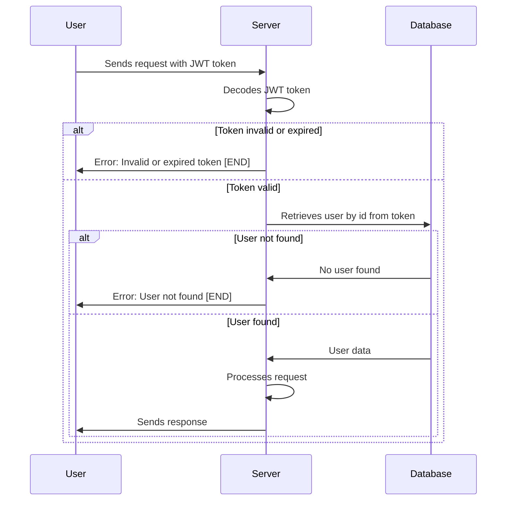

# User Authentication Sequence

```mermaid
sequenceDiagram
    participant User
    participant Server
    participant Database
    
    User->>Server: Sends email and password
    Server->>Database: Retrieves user by email
    alt User not found
        Database->>Server: No user found
        Server->>User: Error: Invalid email or password [END]
    else User found
        Server->>Server: Checks password
        alt Password incorrect
            Server->>User: Error: Invalid email or password [END]
        else Password correct
            Server->>Server: Checks user status
            alt User not active
                Server->>User: Error: Account not active [END]
            else User active
                Server->>Server: Generates JWT token
                Server->>User: Sends JWT token as cookie
            end
        end
    end
```

# Subsequent Requests Sequence

```mermaid
sequenceDiagram
    participant User
    participant Server
    participant Database
    
    User->>Server: Sends request with JWT token
    Server->>Server: Decodes JWT token
    alt Token invalid or expired
        Server->>User: Error: Invalid or expired token [END]
    else Token valid
        Server->>Database: Retrieves user by id from token
        alt User not found
            Database->>Server: No user found
            Server->>User: Error: User not found [END]
        else User found
            Database->>Server: User data
            Server->>Server: Processes request
            Server->>User: Sends response
        end     
    end
```