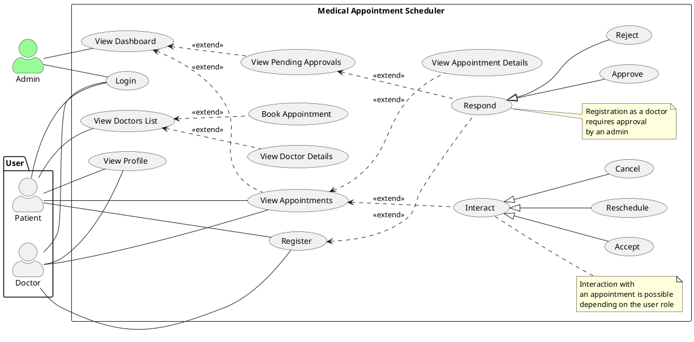

```plantuml
@startuml
left to right direction
skinparam actorStyle awesome

actor Admin #palegreen

package User {
    actor Patient
    actor Doctor
}
rectangle "Medical Appointment Scheduler" {
    Patient -- (Register)
    Patient -- (Login)
    Patient -- (View Profile)
    Patient -- (View Doctors List)
    Patient -- (View Appointments)
    
    Doctor -- (Register)
    Doctor -- (Login)
    Doctor -- (View Profile)
    Doctor -- (View Appointments)
    
    Admin -- (Login)
    Admin -- (View Dashboard)
    
    (Register) <.. (Respond) : <<extend>>
    (View Doctors List) <.. (View Doctor Details) : <<extend>>
    (View Doctors List) <.. (Book Appointment) : <<extend>>
    (View Dashboard) <.. (View Pending Approvals) : <<extend>>
    (View Pending Approvals) <.. (Respond) : <<extend>>
    (View Dashboard) <.. (View Appointments) : <<extend>>
    (View Appointments) <.. (Interact) : <<extend>>
    (View Appointments) <.. (View Appointment Details) : <<extend>>
    
    (Respond) <|-- (Approve)
    (Respond) <|-- (Reject)
    (Interact) <|-- (Accept)
    (Interact) <|-- (Reschedule)
    (Interact) <|-- (Cancel)
    
    note "Registration as a doctor\nrequires approval\nby an admin" as N1
    (Respond) .. N1
    
    note "Interaction with\nan appointment is possible\ndepending on the user role" as N2
    (Interact) .. N2
@enduml
```
